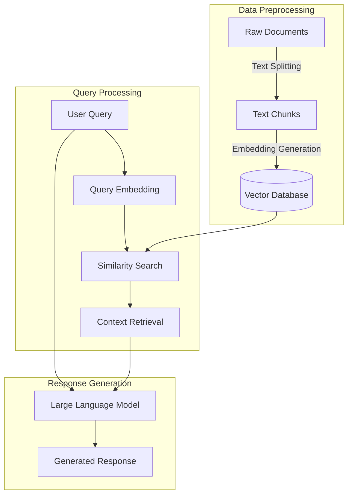
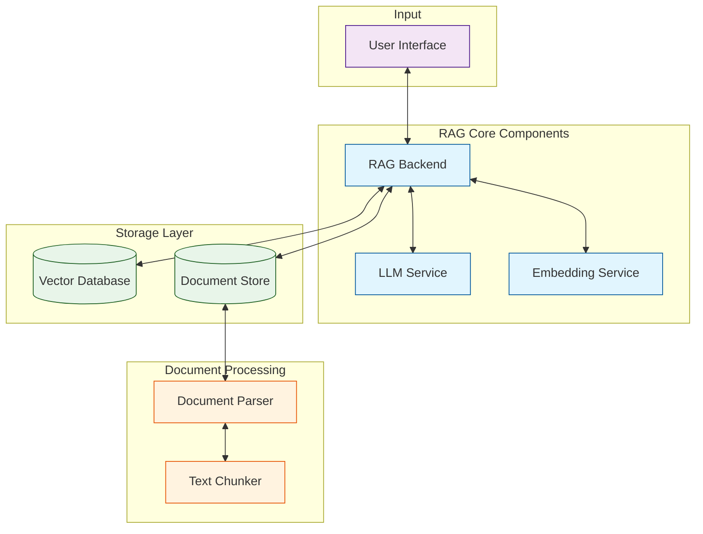
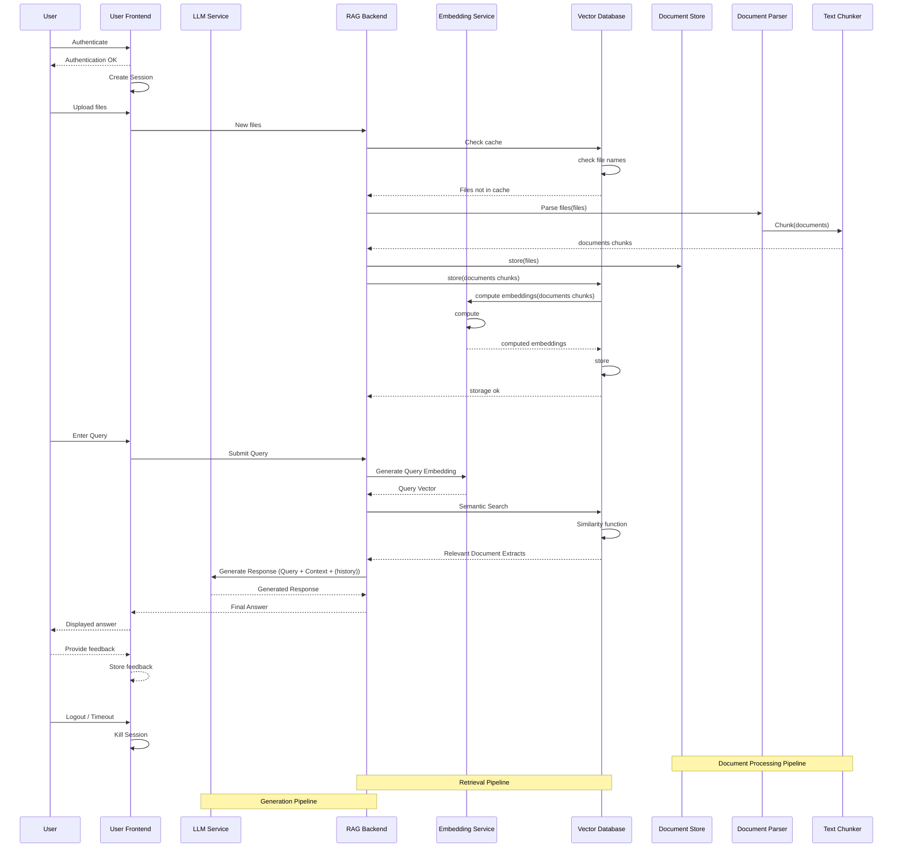
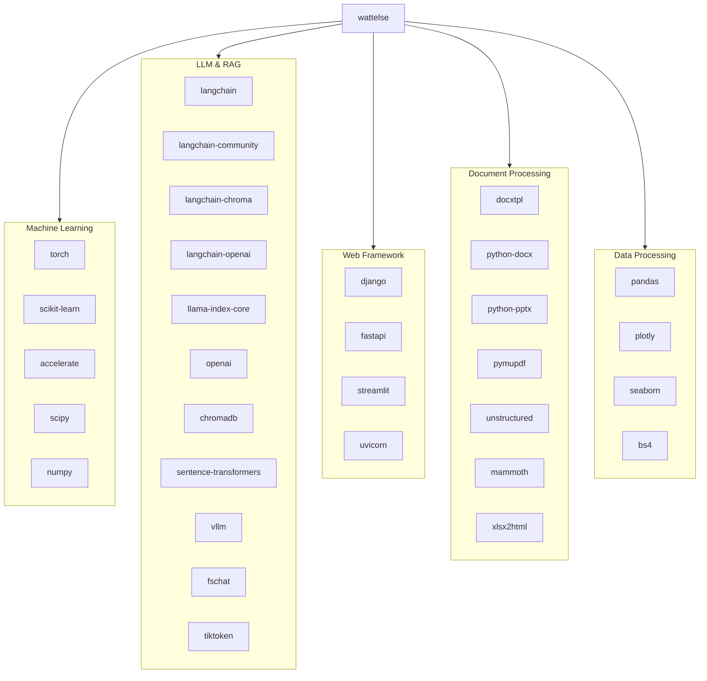

# WattElse project

WattElse is a NLP suite developed for the needs of RTE (Réseau de Transport d'Electricité).

It is composed of two main modules:

- a simple chatbot interface to interact with any LLM -> **WattElse GPT**
- a Retrieval Augmented Generation (RAG) application -> **WattElse DOC**

Some services are used by several applications/users at the same time. To optimize resource use, these services are implemented in the form of APIs. A description of these services is available in [wattelse/api](wattelse/api).

WattElse also includes helper modules that provide additional functionalities such as summaries, web scrapping, and document parsing.

## Installation

Before trying to install WattElse, you first need to ensure you have:

- `python >= 3.10`
- `sqlite3 >= 3.35`

Clone this project:

```bash
git clone https://github.com/rte-france/wattelse.git
```

Create a virtual environment:

```bash
cd wattelse
python -m venv .venv
source .venv/bin/activate
```

Install WattElse and its dependencies:

```bash
./install.sh
```

## Environnement variables

To run WattElse, you need to set the following environment variables:

- `WATTELSE_BASE_DIR`: path where WattElse data will be stored
- `DJANGO_SECRET_KEY`: Django secret key (see [Django documentation](https://docs.djangoproject.com/en/4.2/ref/settings/#std-setting-SECRET_KEY))

To create a Django `SECRET_KEY`, run the following code in a python shell:

```python
from django.core.management.utils import get_random_secret_key
print(get_random_secret_key())
```

## Django initialization

To initialize the Django database, follow these steps:

- Go to the django `web_app` folder:

```bash
cd wattelse/web_app
```

- Create Django tables:

```bash
python manage.py makemigrations
python manage.py migrate
```

- Create Django superuser:

```bash
python manage.py createsuperuser
```

- Start Django server:

```bash
python start.py
```

Django web app should be running at: http://localhost:8000

## Launch WattElse

To launch WattElse with all services, go to WattElse root folder and run:

```bash
./start_all_services.sh
```

This script starts all services in separated `screens`:

- Embedding API
- RAGOrchestrator API
- Django
-

## Hardware requirements

By default, WattElse only loads an embedding model on start. It requires around 2GB of VRAM if loaded on GPU.

The LLM used depends on the RAG config. By default, no local LLM is loaded so you need to link RAG config to a remote LLM (OpenAI, Azure...). For RAG config management, see [wattelse/rag_backend](wattelse/rag_backend).

If you want to load a local LLM using `vLLM`, you need to have enough VRAM to load the model. For example, the `llama-3.1-8B-instruct` model requires around 16GB of VRAM.

# RAG service

## Overview of main steps



## Description of components



## Simplified sequence diagram for RAG



## Main code dependencies


