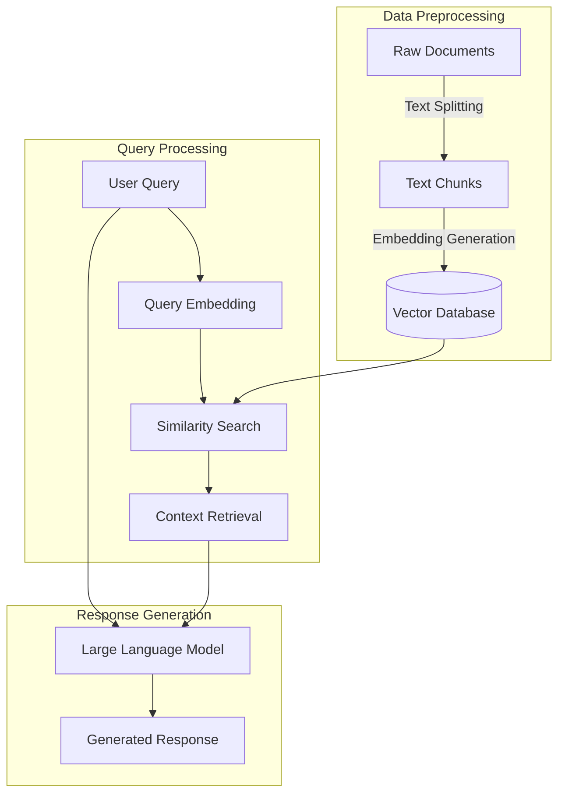
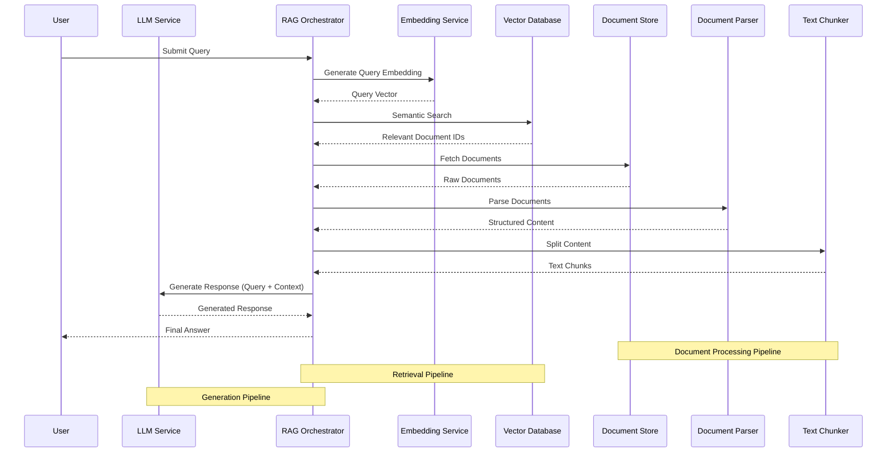

# WattElse project

## Short description

WattElse is a NLP suite developed for the needs of RTE (Réseau de Transport d'Electricité).

It is composed of two main modules:
- a Retrieval Augmented Generation (RAG) application -> **WattElse Doc**
- a simple chatbot interface to deploy and interact with any LLM -> **WattElse GPT**

Some services are used by several applications/users at the same time. To optimize resource use, these services are implemented in the form of APIs. A description of these services is available in [wattelse/api](wattelse/api).

WattElse also includes helper modules that provide additional functionalities such as summaries, web scrapping, and document parsing.

## Installation

Before trying to install WattElse, you first need to ensure you have:
- python >= 3.10
- sqlite3 >= 3.35

Then, create a virtual environnement:

```bash
python3 -m venv ~/.venv/wattelse-venv
source ~/.venv/wattelse-venv/bin/activate
```

You can then install the project dependencies with the following command:

```bash
./install.sh
```

## Hardware requirements

WattElse uses embedding models for *RAG*. It also uses larger generative models for responses. By default, all models are loaded on GPU. For *RAG*, you will for example need:
- 1 GPU with > 20Go (or several smaller GPUs)

# RAG service

## Overview of main steps 


 
## Description of components


## Sequence diagram for RAG


## Main code dependencies
 ```mermaid
flowchart TB
    wattelse["wattelse v1.2.2"]
    
    subgraph ML["Machine Learning"]
        torch["torch 2.4.0"]
        sklearn["scikit-learn 1.5.2"]
        accelerate["accelerate 1.0.0"]
        scipy["scipy 1.14.1"]
        numpy["numpy <2"]
    end
    
    subgraph LLM["LLM & RAG"]
        langchain["langchain 0.3.2"]
        langchain_comm["langchain-community 0.3.1"]
        langchain_chroma["langchain-chroma 0.1.4"]
        langchain_openai["langchain-openai 0.2.2"]
        llama_index["llama-index-core 0.11.16"]
        openai["openai 1.51.1"]
        chromadb["chromadb 0.5.11"]
        sent_trans["sentence-transformers 3.1.1"]
        vllm["vllm 0.6.1"]
        fschat["fschat 0.2.36"]
        tiktoken["tiktoken 0.7.0"]
    end
    
    subgraph Web["Web Framework"]
        django["django 5.1.1"]
        fastapi["fastapi 0.115.0"]
        streamlit["streamlit 1.39.0"]
        uvicorn["uvicorn 0.31.0"]
    end
    
    subgraph Doc["Document Processing"]
        docxtpl["docxtpl 0.18.0"]
        python_docx["python-docx 1.1.2"]
        python_pptx["python-pptx 1.0.2"]
        pymupdf["pymupdf 1.24.11"]
        unstructured["unstructured 0.15.13"]
        mammoth["mammoth 1.8.0"]
        xlsx2html["xlsx2html 0.6.1"]
    end
    
    subgraph Data["Data Processing"]
        pandas["pandas 2.2.3"]
        plotly["plotly 5.24.1"]
        seaborn["seaborn 0.13.2"]
        bs4["bs4 0.0.2"]
    end
    
    wattelse --> ML
    wattelse --> LLM
    wattelse --> Web
    wattelse --> Doc
    wattelse --> Data
```