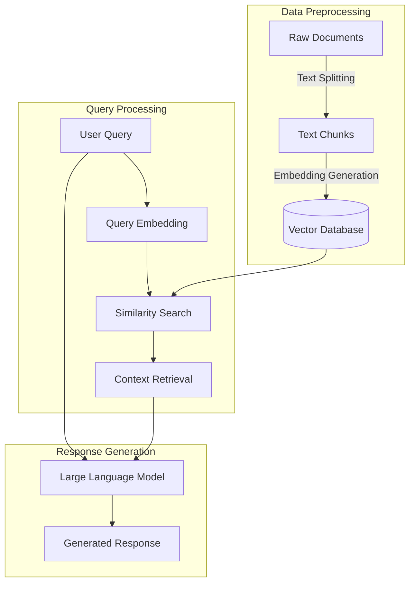
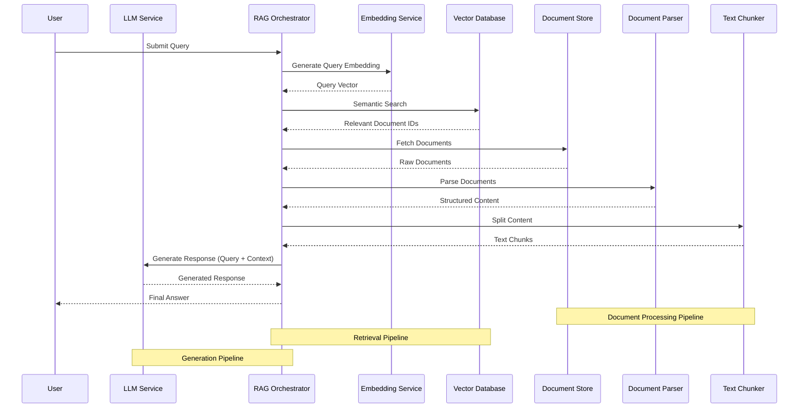

# WattElse project

## Short description

WattElse is a NLP suite developed for the needs of RTE (Réseau de Transport d'Electricité).

It is composed of two main modules:
- a Retrieval Augmented Generation (RAG) application -> **WattElse Doc**
- a simple chatbot interface to deploy and interact with any LLM -> **WattElse GPT**

Some services are used by several applications/users at the same time. To optimize resource use, these services are implemented in the form of APIs. A description of these services is available in [wattelse/api](wattelse/api).

WattElse also includes helper modules that provide additional functionalities such as summaries, web scrapping, and document parsing.

## Installation

Before trying to install WattElse, you first need to ensure you have:
- python >= 3.10
- sqlite3 >= 3.35

Then, create a virtual environnement:

```bash
python3 -m venv ~/.venv/wattelse-venv
source ~/.venv/wattelse-venv/bin/activate
```

You can then install the project dependencies with the following command:

```bash
./install.sh
```

## Hardware requirements

WattElse uses embedding models for *RAG*. It also uses larger generative models for responses. By default, all models are loaded on GPU. For *RAG*, you will for example need:
- 1 GPU with > 20Go (or several smaller GPUs)

# RAG service

## Overview of main steps 


 
## Description of components


## Sequence diagram for RAG

