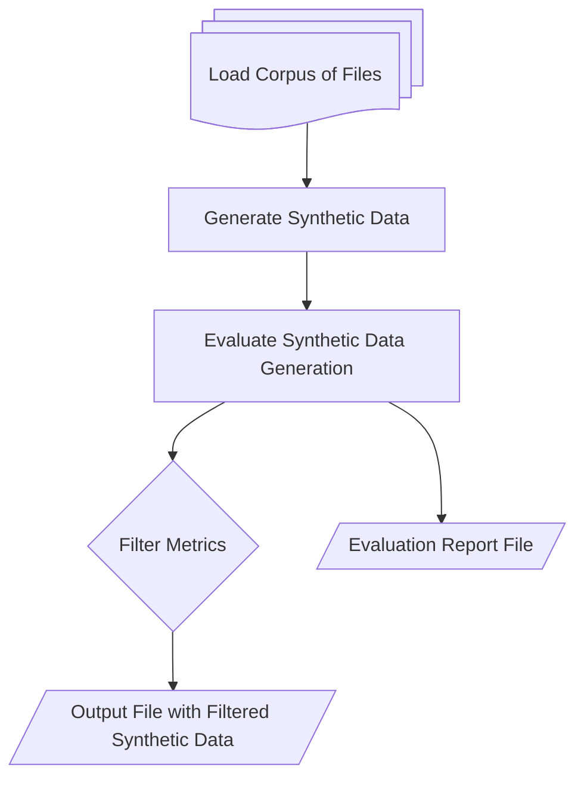
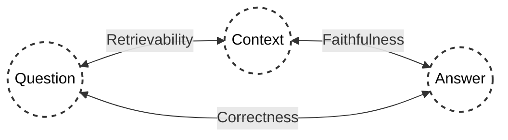

# WattElse Evaluation Pipeline

## Overview
This folder contains the main scripts used for RAG evaluation.

The evaluation pipeline is divided into **two section** :

### 1. Generating Synthethic Test Data 

From the corpus of your choice.



### Filter Metrics Score

<div style="display: flex; justify-content: space-between; align-items: center;">
  <!-- First Table -->
  <table style="width: 45%;">
    <thead>
      <tr>
        <th>Question</th>
        <th>Context</th>
        <th>Answer</th>
        <th>Complexity</th>
        <th>Metric Evaluation</th>
        <th>Metric Score</th>
      </tr>
    </thead>
    <tbody>
      <tr>
        <td>Q1</td>
        <td>Context1</td>
        <td>A1</td>
        <td>Simple</td>
        <td>E1</td>
        <td>5/5</td>
      </tr>
      <tr>
        <td>Q2</td>
        <td>Context2</td>
        <td>A2</td>
        <td>Reasoning</td>
        <td>E2</td>
        <td>4/5</td>
      </tr>
      <tr>
        <td>Q3</td>
        <td>Context3</td>
        <td>A3</td>
        <td>Multi-Context</td>
        <td>E3</td>
        <td>5/5</td>
      </tr>
      <!-- Entire Q4 Row with Strikethrough -->
      <tr style="text-decoration: line-through;">
        <td>Q4</td>
        <td>Context4</td>
        <td>A4</td>
        <td>Reasoning</td>
        <td>E4</td>
        <td>1/5</td>
      </tr>
    </tbody>
  </table>

  <!-- Arrow pointing to the right -->
  <div style="text-align: center;">
    <svg width="50" height="50">
      <line x1="0" y1="25" x2="40" y2="25" stroke="black" stroke-width="2" />
      <polygon points="40,20 50,25 40,30" fill="black" />
    </svg>
  </div>

  <!-- Second Table -->
  <table style="width: 45%;">
    <thead>
      <tr>
        <th>Question</th>
        <th>Complexity</th>
        <th>Source Documents</th>
      </tr>
    </thead>
    <tbody>
      <tr>
        <td>Q1</td>
        <td>Simple</td>
        <td>Doc1</td>
      </tr>
      <tr>
        <td>Q2</td>
        <td>Reasoning</td>
        <td>Doc2</td>
      </tr>
      <tr>
        <td>Q3</td>
        <td>Multi-Context</td>
        <td>Doc 3, 4</td>
      </tr>
    </tbody>
  </table>
</div>


## Output File with Filtered Synthetic Data

| Question                                                                                                        | Complexity     | Source Documents      | ...     | Context | Answer |
| --------------------------------------------------------------------------------------------------------------- | -------------- | --------------------- | ------- | ------- | ------ |
| Quel est le montant de la prime d'accompagnement au télétravail ?                                               | Simple         | `Document 1`            | ...     | ...     | ...    |
| Pourquoi le télétravail de dépannage ne peut-il pas être lié à une problématique individuelle ?                 | Reasoning      | `Document 1`            | ...     | ...     | ...    |
| Quels sont les objectifs des mesures d'accompagnement du changement lié à la mise en œuvre des Nouveaux Modes de Travail ? | Multi-Context  | `Documents 3, 4`        | ...     | ...     | ...    |
| ...                                                                                                             | ...            | ...                   | ...     | ...     | ...    |

**Note:**  
- **Context** and **Answer** columns are included in this file but are not used for system testing in this evaluation.
- Only the **Question** and **Source Documents** columns are utilized as inputs in our RAG system for further assessment.

## 2. Evaluating WattElse Doc System 

The evaluation pipeline evaluates the **generation** and the **retrieval** part of the RAG using custom made prompts.



Three metrics were defined :
- **Retrievability** : Measures how well the retriever component surfaces relevant and sufficient information needed to asnwer the question accurately.

- **Faithfulness** : Ensures that the answer stays faithful to the information within the retrieved contexst, measuring if the model avoided introducing unrelated or inaccurate information.

- **Correctness** : Assesses the factual reliability and completeness of the answer provided, ensuring that it directly addresses the question posed without containing errors, omissions, or misleading information.

**TODO Discounted Cumulative Gain (DCG)** is a metric used to evaluate the effectiveness of search engine rankings. It measures the relevance of search results while considering their positions, with more relevant documents receiving higher scores when placed higher in the list.


| Question | Answer | Complexity | Source Document | Relevant Extracts | Faithfulness Evaluation | Faithfulness Score | Correctness Evaluation | Correctness Score | Retrievability Evaluation | Retrievability Score |
| -------- | ------ | ---------- | --------------- | ----------------- | ----------------------- | ------------------ | ---------------------- | ----------------- | -------------------------- | --------------------- |
| Quel est le montant de la prime d'accompagnement au télétravail ? | La prime d'accompagnement au télétravail est d'un montant de 150 euros, qui sera versée sur la paye d'octobre 2022 à tous les salariés en activité le 19 octobre 2022. | Simple | `['NMT-Accord-télétravail.pdf']` | "Extrait 1: Page 11 sur 14... Extrait 10: Article 4 - Le télétravail régulier des salariés ayant opté pour le régime du forfait jours..." | "La réponse est entièrement fidèle au contexte fourni. Elle extrait un élément du texte, à savoir la prime d'accompagnement au télétravail..." | 5/5 | "La réponse est globalement correcte, elle inclut quelques informations supplémentaires ..." | 4/5 | "Le contexte répond directement à la question..." | 5/5 |


## Usage

Go to the eval folder:

```bash
cd wattelse/chatbot/eval
```

Run this command to show infos:

```bash
python main.py --help
```

The script takes two mandatory arguments as input:
- `qr_df_path`: path to the evaluation QR dataframe. The file must be a `.xlsx` file. It must contains the columns:
    - `query`: the query to be evaluated
    - `answser`: the ground truth
    - `doc_list`: the document list the RAG should use to generate the answer, in a python list format, e.g. `["doc1.pdf", "doc2.docx", ...]`

    See [here](https://rtefrance.sharepoint.com/:x:/r/sites/Signauxfaibles/Shared%20Documents/General/RAG%20Evaluation/Corpus%20evaluation/Eval_BE/QR_BE.xlsx?d=w9098383374274af594c80c233d397725&csf=1&web=1&e=DQWyZm) for an example file.
- `eval_corpus_path`: path to the evaluation corpus folder. The folder must contain all documents needed for the evaluation, i.e. all documents listed in the `doc_list` column of the QR dataframe.

Example usage:
```bash
python main.py /path/to/qr_df.xlsx /path/to/eval_corpus/
```

You can specifiy the path to the output result using the `--output_path` argument, for example:

```bash
python main.py /path/to/qr_df.xlsx /path/to/eval_corpus/ --output_path /path/to/output.xlsx
```