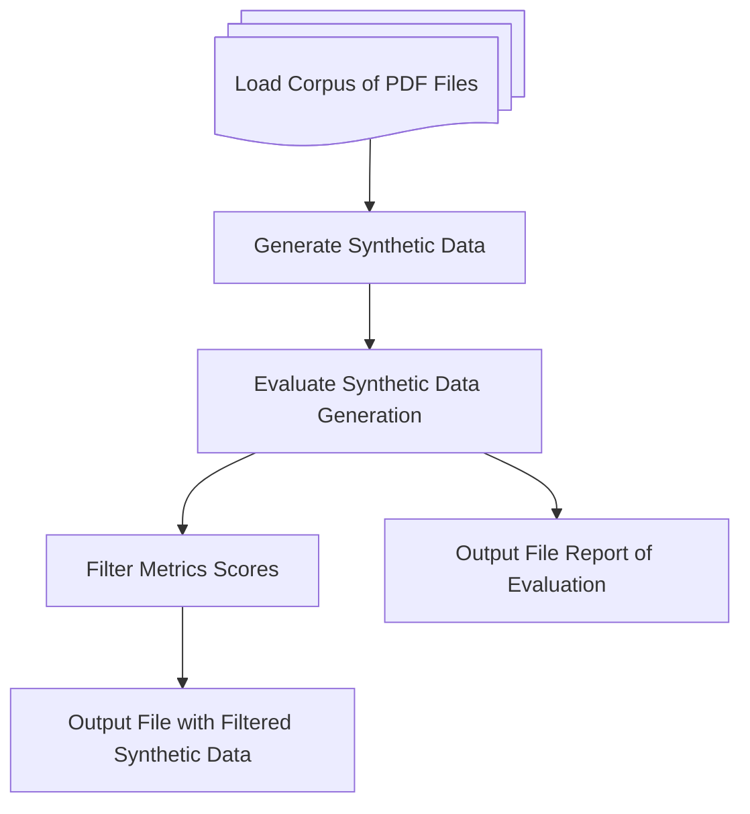
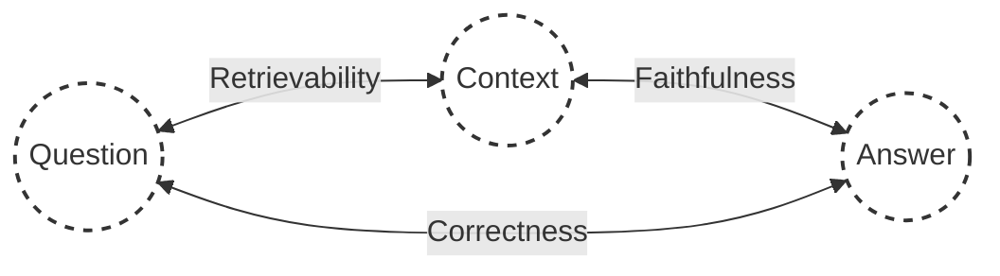

# WattElse Evaluation Pipeline

## Overview
This folder contains the main scripts used for RAG evaluation.

The evaluation pipeline is divided into **two section** :

### 1. Generating Synthethic Test Data 

This parts from the corpus of your choice (currently supporting .pdf files only).



### 2. Evaluating WattElse System 

The evaluation pipeline evaluates the **generation** and the **retrieval** part of the RAG using custom made prompts.



Three metrics were defined :
- **Retrievability** : Measures how well the retriever component surfaces relevant and sufficient information needed to asnwer the question accurately.

- **Faithfulness** : Ensures that the answer stays faithful to the information within the retrieved contexst, measuring if the model avoided introducing unrelated or inaccurate information.

- **Correctness** : Assesses the factual reliability and completeness of the answer provided, ensuring that it directly addresses the question posed without containing errors, omissions, or misleading information.

## Usage

Go to the eval folder:

```bash
cd wattelse/chatbot/eval
```

Run this command to show infos:

```bash
python main.py --help
```

The script takes two mandatory arguments as input:
- `qr_df_path`: path to the evaluation QR dataframe. The file must be a `.xlsx` file. It must contains the columns:
    - `query`: the query to be evaluated
    - `answser`: the ground truth
    - `doc_list`: the document list the RAG should use to generate the answer, in a python list format, e.g. `["doc1.pdf", "doc2.docx", ...]`

    See [here](https://rtefrance.sharepoint.com/:x:/r/sites/Signauxfaibles/Shared%20Documents/General/RAG%20Evaluation/Corpus%20evaluation/Eval_BE/QR_BE.xlsx?d=w9098383374274af594c80c233d397725&csf=1&web=1&e=DQWyZm) for an example file.
- `eval_corpus_path`: path to the evaluation corpus folder. The folder must contain all documents needed for the evaluation, i.e. all documents listed in the `doc_list` column of the QR dataframe.

Example usage:
```bash
python main.py /path/to/qr_df.xlsx /path/to/eval_corpus/
```

You can specifiy the path to the output result using the `--output_path` argument, for example:

```bash
python main.py /path/to/qr_df.xlsx /path/to/eval_corpus/ --output_path /path/to/output.xlsx
```