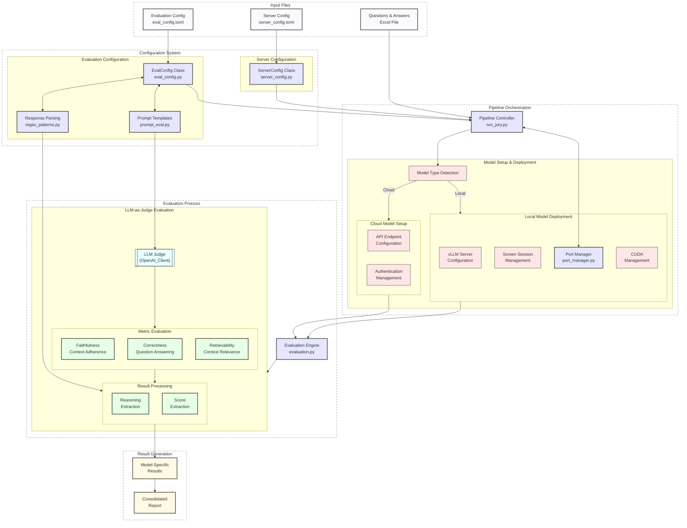

# Wattelse RAG Evaluation Pipeline

A robust evaluation pipeline for Retrieval-Augmented Generation (RAG) systems using Large Language Models (LLMs) as a jury. This pipeline evaluates RAG responses across multiple dimensions using different LLMs to provide comprehensive assessment metrics.

## System Architecture
The following diagram illustrates how the different components of the evaluation pipeline work together:


The diagram shows the main components and data flow of the evaluation pipeline:

- Input layer processes the evaluation data and configuration files
- Configuration system manages evaluation and server settings
- Evaluation process performs the core metrics assessment
- Pipeline orchestration handles model management
- Output generation combines results from all evaluators

## Features

- Multi-model evaluation using different LLMs as jury members
- Three key evaluation metrics:
  - **Correctness**: Assesses if the response accurately answers the question
  - **Faithfulness**: Measures how well the response aligns with the provided context
  - **Retrievability**: Evaluates the relevance and sufficiency of retrieved context
- Sequential evaluation pipeline with automatic model switching
- Configurable evaluation and server settings
- Parallel processing for efficient evaluation
- Comprehensive result aggregation and reporting through a Streamlit app

## Prerequisites

- TODO

## Installation

- TODO

## Configuration

The evaluation pipeline uses two separate configuration files:

### Evaluation Configuration File (`eval_config.toml`)

The evaluation pipeline is configured through `eval_config.toml`. Key sections include:

```ini
[EVAL_CONFIG]
enabled_metrics = ["faithfulness", "correctness", "retrievability"]

# for local-hosted models
[MODEL_META_LLAMA_META_LLAMA_3_8B_INSTRUCT]
model_name = "$LOCAL_OPENAI_DEFAULT_MODEL_NAME"
prompt_type = "meta-llama-3-8b"
regex_type = "re_llama3"
temperature = 0.0

# for cloud-hosted models
[MODEL_WATTELSE_GPT4O_MINI_SWEDEN_DEV]
model_name = "$AZURE_SE_WATTELSE_OPENAI_DEFAULT_MODEL_NAME_DEV"
deployment_type = "cloud"
api_base = "$AZURE_SE_WATTELSE_OPENAI_ENDPOINT_DEV"
api_key = "$AZURE_SE_WATTELSE_OPENAI_API_KEY_DEV"
prompt_type = "vanilla"
regex_type = "default"
temperature = 0.0

...
```
### Evaluation Configuration:
- `enabled_metrics`: List of metrics to evaluate
- Model-specific settings (`model_name`, `prompt_type`, `regex_type`, `temperature`)


### Evaluation Configuration File (`server_config.toml`)

Manages server and deployment settings:

```ini
[SERVER_CONFIG]
host = "0.0.0.0"
port = 8888
port_controller = 21001
port_worker = 21002
cuda_visible_devices = [0, 1]
```
## Usage

### Running the Full Evaluation Pipeline (LLM as Judge/Jury)

```bash
# Basic usage
python run_jury.py /path/to/data.xlsx

# With all options specified
python run_jury.py /path/to/data.xlsx \
    --eval-config-path /path/to/eval_config.toml \
    --server-config-path /path/to/server_config.toml \
    --output-dir /path/to/evaluation_results \
    --overwrite

# Example with specific paths
python run_jury.py ./data/rag_responses.xlsx \
    --eval-config-path ./configs/jury_eval_config.toml \
    --server-config-path ./configs/server_config.toml \
    --output-dir ./results/jury_evaluation
```

1. Prepare your evaluation dataset in Excel format with the following columns:
   - `question`: The input question
   - `answer`: The RAG system's response
   - `source_doc`: Source documents used
   - `rag_relevant_extracts`: RAG relevant extracts from context

2. Run the evaluation pipeline:
```bash
python run_jury.py path/to/your/data.xlsx \
    --eval-config-path eval_config.toml \
    --server-config-path server_config.toml \
    --output-dir evaluation_results
```

### Command-line Arguments

#### Common Arguments
- `qr_df_path`: Path to the Excel file containing questions and responses
- `--eval-config-path`: Path to the configuration file
- `--server-config-path`: Path to the server configuration file
- `--overwrite`: Overwrite existing output file if it exists (default: False)
  > ⚠️ **Warning**: Using this flag will delete any existing file at the output path without confirmation. Use with caution to avoid data loss.

#### For evaluation.py (Single Model)
- `--report-output-path`: Path for the evaluation results Excel file (default: "report_output.xlsx")

#### For run_jury.py (Multiple Models)
- `--output-dir`: Directory for evaluation results (default: "evaluation_results")

# RAG Evaluation Framework

## Evaluation Metrics (Coarsed-grained)

This framework evaluates three key aspects of RAG systems using a consistent judgment scale from 1-5 (where 1 is very insufficient and 5 is very satisfactory).

### Correctness Evaluation

Assesses whether the response correctly answers the question by providing essential information without significant factual errors:

- **Completeness Check**: Evaluates if the response addresses all key aspects of the question
- **Accuracy Assessment**: Identifies factual errors or misinterpretations
- **Relevance Control**: Ensures the response aligns with what was asked

### Faithfulness Evaluation

Examines whether the response is based solely on the provided context without introducing unsupported information:

- **Alignment Analysis**: Checks for correspondence between response and source context
- **Support Verification**: Identifies which statements are supported vs. unsupported by the context
- **Contradiction Detection**: Assesses whether the response contradicts information in the context
- **Attribution Quality**: Evaluates how well claims are grounded in the provided materials

### Retrievability Evaluation

Determines whether the retrieved context is relevant and sufficient to answer the given question:

- **Information Sufficiency**: Assesses if the context contains all necessary information
- **Relevance Ratio**: Evaluates the proportion of relevant vs. irrelevant excerpts
- **Answer Enablement**: Checks if the context directly allows the question to be answered
- **Comprehensiveness**: Determines if all aspects of the question can be addressed using the retrieved materials

Each metric is evaluated by LLM judges using carefully calibrated prompts specific to each model's capabilities and tendencies.

## Output

The pipeline generates:
- Individual evaluation files for each model
- A combined evaluation file with results from all models
- Detailed scoring and feedback for each evaluation metric

## Architecture

The evaluation pipeline consists of several key components:

1. **Evaluation Controller** (`run_jury.py`):
   - Manages the evaluation sequence
   - Handles model switching
   - Coordinates result aggregation

2. **Evaluation Engine** (`evaluation.py`):
   - Implements core evaluation logic
   - Processes individual responses
   - Calculates metrics

3. **Configuration Manager** (`eval_config.py`):
   - Manages evaluation settings
   - Handles model-specific configurations

4. **Prompt Management** (`prompt_eval.py`):
   - Stores evaluation prompts
   - Manages prompt templates


## Subdirectories

- `config/` - Configuration management for evaluation and server settings
- `prompts/` - Prompt templates for different evaluation metrics and models
- `utils/` - Utility functions and helper classes
