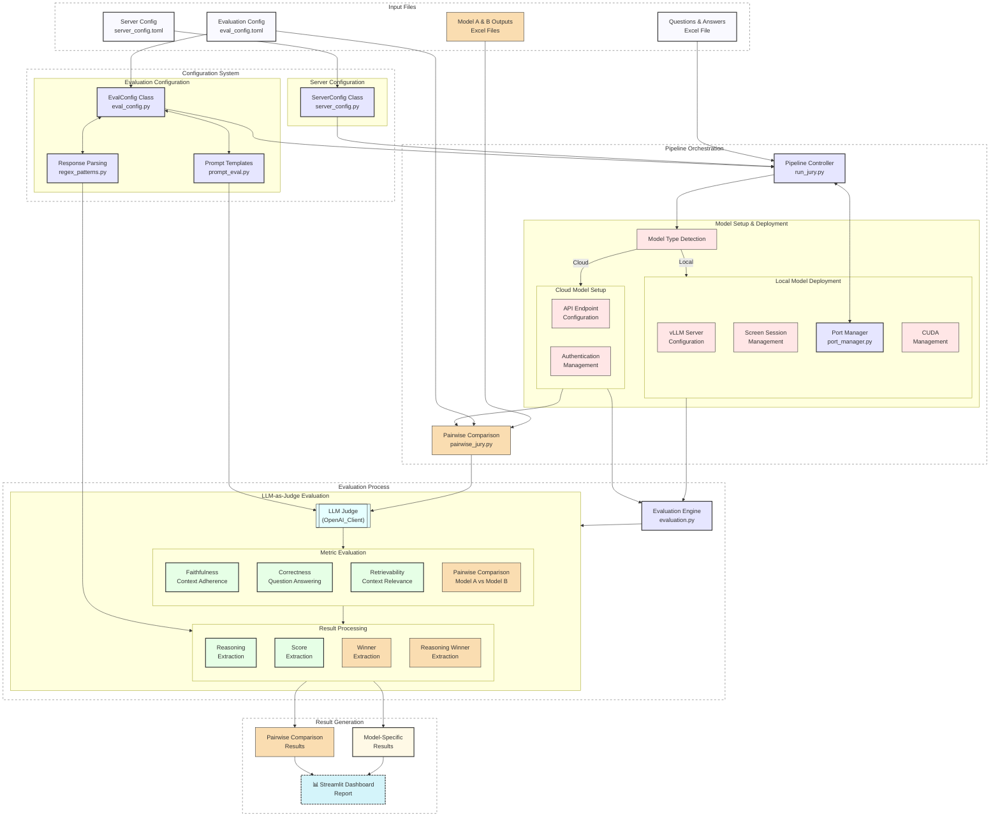

# Wattelse RAG Evaluation Pipeline

Evaluation pipeline for Retrieval-Augmented Generation (RAG) systems using Large Language Models (LLMs) as a jury. This pipeline evaluates RAG responses across multiple dimensions using different LLMs to provide comprehensive assessment metrics.

## System Architecture
The following diagram illustrates how the different components of the evaluation pipeline work together:



## Features

- Multi-model evaluation using different LLMs as jury members
- Flexible evaluation methods:
  - **Criteria-based evaluation**: Assesses individual models on specific metrics
  - **Pairwise comparison**: Directly compares two model outputs against each other
- Three key evaluation metrics:
  - **Correctness**: Assesses if the response accurately answers the question
  - **Faithfulness**: Measures how well the response aligns with the provided context
  - **Retrievability**: Evaluates the relevance and sufficiency of retrieved context
- Sequential evaluation pipeline with automatic model switching
- Configurable evaluation and server settings
- Parallel processing for efficient evaluation
- Comprehensive result aggregation and reporting through a Streamlit app

## Prerequisites

- TODO

## Installation

- TODO

## Configuration

The evaluation pipeline uses two separate configuration files:

### Evaluation Configuration File (`eval_config.toml`)

The evaluation pipeline is configured through `eval_config.toml`. Key sections include:

```ini
[EVAL_CONFIG]
enabled_metrics = ["faithfulness", "correctness", "retrievability", "correctness_pairwise", "retrievability_pairwise"]

# for local-hosted models
[MODEL_META_LLAMA_META_LLAMA_3_8B_INSTRUCT]
model_name = "$LOCAL_OPENAI_DEFAULT_MODEL_NAME"
prompt_type = "meta-llama-3-8b"
regex_type = "re_llama3"
temperature = 0.0

# for cloud-hosted models
[MODEL_WATTELSE_GPT4O_MINI_SWEDEN_DEV]
model_name = "$AZURE_SE_WATTELSE_OPENAI_DEFAULT_MODEL_NAME_DEV"
deployment_type = "cloud"
api_base = "$AZURE_SE_WATTELSE_OPENAI_ENDPOINT_DEV"
api_key = "$AZURE_SE_WATTELSE_OPENAI_API_KEY_DEV"
prompt_type = "vanilla"
regex_type = "default"
temperature = 0.0
```

### Evaluation Configuration:
- `enabled_metrics`: List of metrics to evaluate, including criteria-based and pairwise metrics
- Model-specific settings (`model_name`, `prompt_type`, `regex_type`, `temperature`)


### Server Configuration File (`server_config.toml`)

Manages server and deployment settings:

```ini
[SERVER_CONFIG]
host = "0.0.0.0"
port = 8888
port_controller = 21001
port_worker = 21002
cuda_visible_devices = [0, 1]
```

## Usage

### Running the Criteria-Based Evaluation Pipeline (LLM as Judge/Jury)

```bash
# Basic usage
python run_jury.py /path/to/data.xlsx

# With all options specified
python run_jury.py /path/to/data.xlsx \
    --eval-config-path /path/to/eval_config.toml \
    --server-config-path /path/to/server_config.toml \
    --output-dir /path/to/evaluation_results \
    --overwrite

# Example with specific paths
python run_jury.py ./data/rag_responses.xlsx \
    --eval-config-path ./configs/jury_eval_config.toml \
    --server-config-path ./configs/server_config.toml \
    --output-dir ./results/jury_evaluation
```

### Running the Pairwise Comparison Evaluation

```bash
# Basic usage
python pairwise_comparison.py rag_outputs_model1.xlsx rag_outputs_model2.xlsx

# With all options specified
python pairwise_comparison.py rag_outputs_model1.xlsx rag_outputs_model2.xlsx \
    --config-path /path/to/pair_jury_config.toml \
    --output-dir /path/to/pairwise_results \
    --overwrite

# Example with specific paths
python pairwise_comparison.py ./data/mistral_outputs.xlsx ./data/llama_outputs.xlsx \
    --config-path ./configs/pair_jury_01.toml \
    --output-dir ./results/pairwise_comparison
```

### Command-line Arguments

#### Common Arguments
- `--eval-config-path`: Path to the configuration file
- `--server-config-path`: Path to the server configuration file
- `--overwrite`: Overwrite existing output file if it exists (default: False)
  > ⚠️ **Warning**: Using this flag will delete any existing file at the output path without confirmation. Use with caution to avoid data loss.

#### For Criteria-Based Evaluation (`run_jury.py`)
- `qr_df_path`: Path to the Excel file containing questions and responses
- `--output-dir`: Directory for evaluation results (default: "evaluation_results")

#### For Pairwise Comparison (`pairwise_comparison.py`)
- `set1_filename`: Excel Filename of the first model's evaluation results
- `set2_filename`: Excel Filename of the second model's evaluation results
- `--config-path`: Path to the pairwise evaluation configuration file
- `--output-dir`: Directory to save comparison results

# RAG Evaluation Framework

## Evaluation Methods

### Criteria-Based Evaluation

Evaluates individual model outputs on specific metrics using a scoring scale from 1-5 (where 1 is very insufficient and 5 is very satisfactory).

### Pairwise Comparison Evaluation (Correctness)

Directly compares two model outputs against each other, determining which model performs better on specific metrics. For each comparison, the LLM judge must:
- Analyze both responses in detail
- Determine which response is better for the given question
- Provide reasoning for the decision
- Indicate if the comparison is a tie

## Evaluation Metrics

### Correctness Evaluation

Assesses whether the response correctly answers the question by providing essential information without significant factual errors:

- **Completeness Check**: Evaluates if the response addresses all key aspects of the question
- **Accuracy Assessment**: Identifies factual errors or misinterpretations
- **Relevance Control**: Ensures the response aligns with what was asked

### Faithfulness Evaluation

Examines whether the response is based solely on the provided context without introducing unsupported information:

- **Alignment Analysis**: Checks for correspondence between response and source context
- **Support Verification**: Identifies which statements are supported vs. unsupported by the context
- **Contradiction Detection**: Assesses whether the response contradicts information in the context
- **Attribution Quality**: Evaluates how well claims are grounded in the provided materials

### Retrievability Evaluation

Determines whether the retrieved context is relevant and sufficient to answer the given question:

- **Information Sufficiency**: Assesses if the context contains all necessary information
- **Relevance Ratio**: Evaluates the proportion of relevant vs. irrelevant excerpts
- **Answer Enablement**: Checks if the context directly allows the question to be answered
- **Comprehensiveness**: Determines if all aspects of the question can be addressed using the retrieved materials

**Note**: Each metric is evaluated by LLM judges using carefully calibrated prompts specific to each model's capabilities and tendencies.

## Output

The pipeline generates:
- Individual evaluation files for each model
- Combined evaluation file with results from all models
- Detailed scoring and feedback for each evaluation metric
- Pairwise comparison results showing which model performs better on each metric

## Architecture

The evaluation pipeline consists of several key components:

1. **Evaluation Controller** (`run_jury.py`):
   - Manages the evaluation sequence
   - Handles model switching
   - Coordinates result aggregation

2. **Pairwise Comparison** (`pairwise_comparison.py`):
   - Compares outputs from different RAG models
   - Uses LLM judges to determine better performing models
   - Generates detailed comparison analysis

3. **Evaluation Engine** (`evaluation.py`):
   - Implements core evaluation logic
   - Processes individual responses
   - Calculates metrics

4. **Configuration Manager** (`eval_config.py`):
   - Manages evaluation settings
   - Handles model-specific configurations

5. **Prompt Management** (`prompt_eval.py`):
   - Stores evaluation prompts
   - Manages prompt templates for both criteria-based and pairwise evaluation


## Subdirectories

- `config/` - Configuration management for evaluation and server settings
- `prompts/` - Prompt templates for different evaluation metrics and models
- `utils/` - Utility functions and helper classes