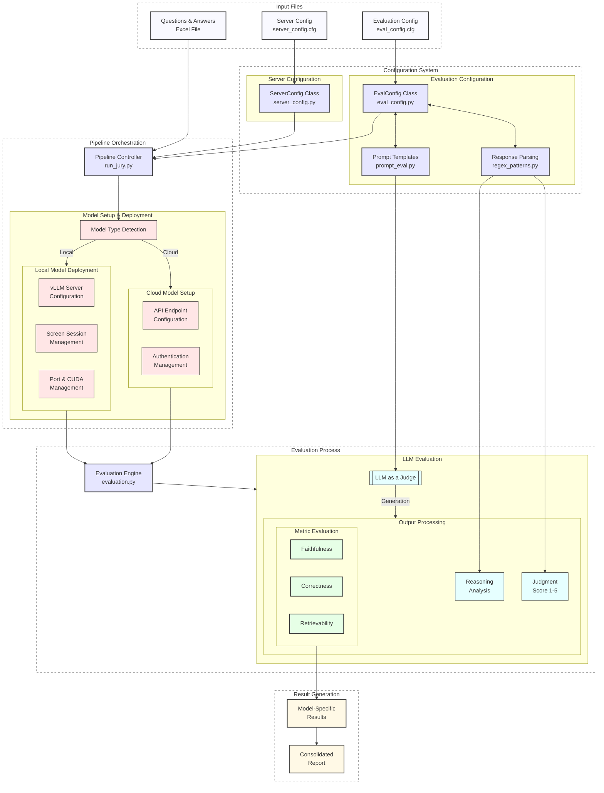

# Wattelse RAG Evaluation Pipeline

A robust evaluation pipeline for Retrieval-Augmented Generation (RAG) systems using Large Language Models (LLMs) as a jury. This pipeline evaluates RAG responses across multiple dimensions using different LLMs to provide comprehensive assessment metrics.

## System Architecture
The following diagram illustrates how the different components of the evaluation pipeline work together:


The diagram shows the main components and data flow of the evaluation pipeline:

- Input layer processes the evaluation data and configuration files
- Configuration system manages evaluation and server settings
- Evaluation process performs the core metrics assessment
- Pipeline orchestration handles model management
- Output generation combines results from all evaluators

## Features

- Multi-model evaluation using different LLMs as jury members
- Three key evaluation metrics:
  - **Correctness**: Assesses if the response accurately answers the question
  - **Faithfulness**: Measures how well the response aligns with the provided context
  - **Retrievability**: Evaluates the relevance and sufficiency of retrieved context
- Sequential evaluation pipeline with automatic model switching
- Configurable evaluation and server settings
- Parallel processing for efficient evaluation
- Comprehensive result aggregation and reporting through a Streamlit app

## Prerequisites

- TODO

## Installation

- TODO

## Configuration

The evaluation pipeline uses two separate configuration files:

### Evaluation Configuration File (`eval_config.cfg`)

The evaluation pipeline is configured through `eval_config.cfg`. Key sections include:

```ini
[EVAL_CONFIG]
enabled_metrics = faithfulness,correctness,retrievability

[MODEL_META_LLAMA_META_LLAMA_3_8B_INSTRUCT]
model_name = meta-llama/Meta-Llama-3-8B-Instruct
prompt_type = meta-llama-3-8b
regex_type = re_llama3
temperature = 0.0

[MODEL_XXX]
model_name = XXX
prompt_type = XXX
regex_type = XXX
temperature = XXX

...
```
### Evaluation Configuration:
- `enabled_metrics`: List of metrics to evaluate
- Model-specific settings (`model_name`, `prompt_type`, `regex_type`, `temperature`)


### Evaluation Configuration File (`server_config.cfg`)

Manages server and deployment settings:

```ini
[SERVER_CONFIG]
host = 0.0.0.0
port = 8888
port_controller = 21001
port_worker = 21002
cuda_visible_devices = 3,2
```

## Usage

### Single Model Evaluation (LLM as Judge)

To use a single LLM model as a judge for evaluation:

```bash
# Basic usage
python evaluation.py /path/to/data.xlsx

# With all options specified
python evaluation.py /path/to/data.xlsx \
    --config-path /path/to/eval_config.cfg \
    --server-config /path/to/server_config.cfg \
    --report-output-path /path/to/output.xlsx

# Use a specific model configuration
export OPENAI_DEFAULT_MODEL_NAME="meta-llama/Meta-Llama-3-8B-Instruct"
python evaluation.py /path/to/rag_responses.xlsx \
    --config-path ./configs/llama_config.cfg \
    --server-config ./configs/server_config.cfg \
    --report-output-path ./results/llama_evaluation.xlsx
```

This mode is useful when you want to:
- Quickly evaluate your RAG system with a single model
- Test different evaluation prompts
- Debug the evaluation process
- Generate preliminary results

The environment variables need to be set according to your model:

```bash
# For local models (Meta-Llama, Prometheus)
export OPENAI_ENDPOINT="http://localhost:8888/v1"
export OPENAI_API_KEY="EMPTY"
export OPENAI_DEFAULT_MODEL_NAME="meta-llama/Meta-Llama-3-8B-Instruct"

# For cloud models
export OPENAI_ENDPOINT="your-cloud-endpoint"
export OPENAI_API_KEY="your-api-key"
export OPENAI_DEFAULT_MODEL_NAME="your-model-name"
```

Make sure your vLLM server is running with the appropriate model before starting the evaluation.

### Running the Full Evaluation Pipeline (LLM as Jury)

```bash
# Basic usage
python run_jury.py /path/to/data.xlsx

# With all options specified
python run_jury.py /path/to/data.xlsx \
    --eval-config-path /path/to/eval_config.cfg \
    --server-config-path /path/to/server_config.cfg \
    --output-dir /path/to/evaluation_results

# Example with specific paths
python run_jury.py ./data/rag_responses.xlsx \
    --eval-config-path ./configs/jury_eval_config.cfg \
    --server-config-path ./configs/server_config.cfg \
    --output-dir ./results/jury_evaluation
```

1. Prepare your evaluation dataset in Excel format with the following columns:
   - `question`: The input question
   - `answer`: The RAG system's response
   - `source_doc`: Source documents used
   - `rag_relevant_extracts`: RAG relevant extracts from context

2. Run the evaluation pipeline:
```bash
python run_jury.py path/to/your/data.xlsx \
    --eval-config-path eval_config.cfg \
    --server-config-path server_config.cfg \
    --output-dir evaluation_results
```

### Command-line Arguments

For evaluation.py (Single Model):
- `qr_df_path`: Path to the Excel file containing questions and responses
- `--eval-config-path`: Path to the configuration file (default: "config.cfg")
- `--server-config-path`: Path to the server configuration file (default: "server_config.cfg")
- `--report-output-path`: Path for the evaluation results Excel file (default: "report_output.xlsx")

For run_jury.py (Multiple Models):
- `qr_df_path`: Path to the Excel file containing questions and responses
- `--eval-config-path`: Path to the configuration file (default: "eval_config.cfg")
- `--server-config-path`: Path to the server configuration file (default: "server_config.cfg")
- `--output-dir`: Directory for evaluation results (default: "evaluation_results")

## Evaluation Metrics

### 1. Correctness (1-5 scale)
- 1: Very insufficient – Largely incorrect, major errors
- 2: Insufficient – Partially correct, significant errors
- 3: Acceptable – Generally answers with some inaccuracies
- 4: Satisfactory – Answers well with minor inaccuracies
- 5: Very satisfactory – Completely correct and precise

### 2. Faithfulness (1-5 scale)
- 1: Very insufficient – Largely unfaithful to context
- 2: Insufficient – Some relevance with unsupported information
- 3: Passable – Relevant with some inaccuracies
- 4: Satisfactory – Mostly faithful with few missing details
- 5: Very satisfactory – Fully faithful and complete

### 3. Retrievability (1-5 scale)
- 1: Very insufficient – Context mostly off-topic
- 2: Insufficient – Partially relevant with missing key information
- 3: Acceptable – Generally relevant but diluted
- 4: Satisfactory – Mostly relevant with few irrelevant parts
- 5: Very satisfactory – Entirely relevant and comprehensive

## Output

The pipeline generates:
- Individual evaluation files for each model
- A combined evaluation file with results from all models
- Detailed scoring and feedback for each evaluation metric

## Architecture

The evaluation pipeline consists of several key components:

1. **Evaluation Controller** (`run_jury.py`):
   - Manages the evaluation sequence
   - Handles model switching
   - Coordinates result aggregation

2. **Evaluation Engine** (`evaluation.py`):
   - Implements core evaluation logic
   - Processes individual responses
   - Calculates metrics

3. **Configuration Manager** (`eval_config.py`):
   - Manages evaluation settings
   - Handles model-specific configurations

4. **Prompt Management** (`prompt_eval.py`):
   - Stores evaluation prompts
   - Manages prompt templates

## Error Handling

The pipeline includes robust error handling:
- Automatic cleanup of stalled processes
- Port management for model servers
- Graceful handling of evaluation failures
- Detailed logging for debugging

## Logging


## Contributing


## License


## Acknowledgments

